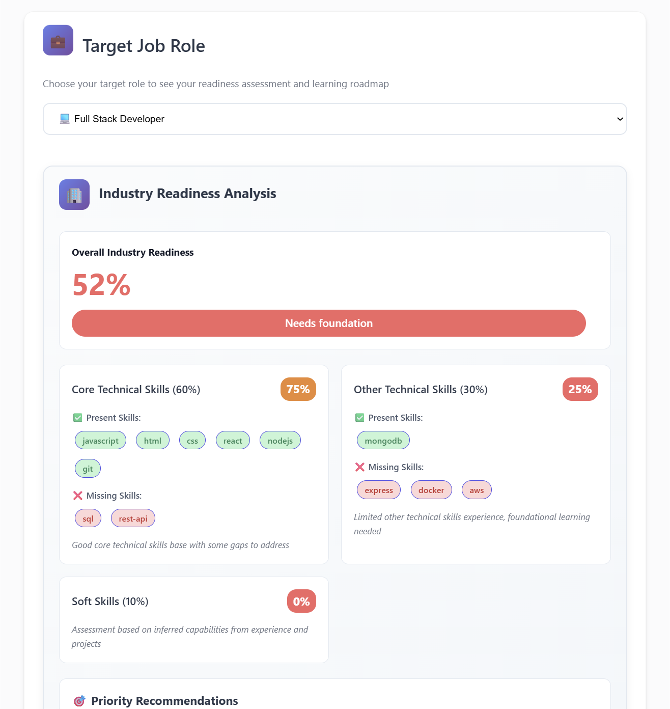
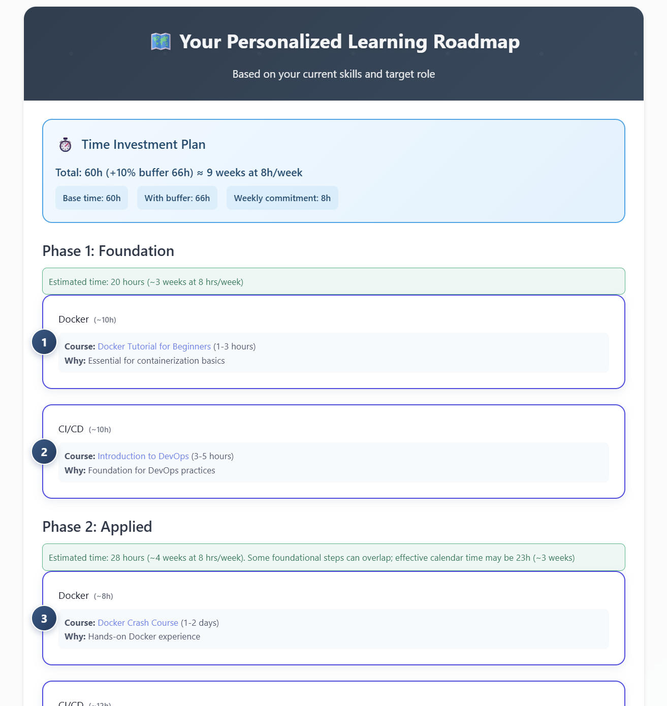

# 🚀 AI-Powered Career Pathfinder Navigator

An intelligent career guidance platform that analyzes skill gaps and generates personalized learning roadmaps using AI agents. This project leverages OpenAI's GPT-4o and LangGraph to provide a comprehensive career assessment and generate a personalized learning path with curated resources to help users transition into their dream tech roles.

## ✨ Key Features

-   **Intelligent Skill Analysis**: Extracts technical skills from PDF and DOCX resumes using AI.
-   **Manual Skill Entry**: Allows users to add skills manually for quick analysis.
-   **Role Readiness Assessment**: Evaluates user skills against industry-standard profiles for over 8 technical careers.
-   **Personalized Learning Roadmaps**: Generates a 3-phase learning path (Foundation, Applied, Capstone) with real course URLs from platforms like Coursera, Udemy, and YouTube.
-   **Multi-Agent AI Pipeline**: Utilizes a sophisticated multi-agent system built with LangGraph for a comprehensive and accurate analysis.
-   **Performance Analytics**: Tracks and displays real-time execution metrics.
-   **Responsive Web Interface**: A clean and intuitive user interface built with HTML, CSS, and JavaScript.

## 🛠️ Technology Stack

| Category                  | Technologies                                |
| :------------------------ | :------------------------------------------ |
| **Backend** |  Flask             |
| **AI & Machine Learning** | LangGraph, LangChain, OpenAI GPT-4o         |
| **Frontend** | HTML5, CSS3, Vanilla JavaScript             |
| **Data Processing** | PyPDF2, python-docx, JSON                   |
| **Deployment** | Render                      |
| **Version Control** | Git, GitHub                                 |

## 📸 Screenshots

Here are a few screenshots of the application in action:

| Screenshot 1                                     | Screenshot 2                                       |
| :----------------------------------------------- | :------------------------------------------------- |
|     |       |
| **Skill Analysis & Readiness Assessment** | **Personalized Roadmap Generation** |

## 🚀 Live Demo

You can view a live demo of the deployed project here:

[**AI Career Pathfinder Navigator**](https://ai-powered-career-pathfinder-navigator.onrender.com)

## 👥 Team Members

This project was developed by a dedicated team of five individuals:

-   [Nishant Narudkar](https://github.com/nishnarudkar)
-   [Saksham Shukla](https://github.com/Saksham-3175)
-   [Vatsal Parmar](https://github.com/Vatsal211005)
-   [Maitreya Pawar](https://github.com/Metzo64)
-   [Aamir Sarang](https://github.com/Aamir-Sarang31)


## 📁 Project Structure
```
AI-Powered-Career-Pathfinder-Navigator/
├── agents/
│   ├── career_logger.py
│   ├── career_pathfinder_optimized.py
│   └── role_readiness_agent.py
├── backend/
│   ├── uploads/
│   └── app.py
├── data/
│   ├── courses.json
│   └── job_roles.json
├── deployment/
│   ├── procfile
│   └── render.yaml
├── docs/
│   └── research/
├── frontend/
│   ├── static/
│   │   ├── animations.js
│   │   ├── script.js
│   │   └── styles.css
│   └── templates/
│       └── index.html
├── .env
├── .gitignore
├── LICENSE
├── README.md
└── requirements.txt
```
## 🚀 Quick Start Guide

### Prerequisites
-   Python 3.9 or higher
-   An OpenAI API key
-   A LangSmith API key (optional, for monitoring)

### Installation

1.  **Clone the repository**
    ```bash
    git clone [https://github.com/nishnarudkar/ai-powered-career-pathfinder-navigator.git](https://github.com/nishnarudkar/ai-powered-career-pathfinder-navigator.git)
    cd ai-powered-career-pathfinder-navigator
    ```

2.  **Install the dependencies**
    ```bash
    pip install -r requirements.txt
    ```

3.  **Set up the environment variables**
    - Create a file named `.env` in the root directory.
    - Add your API keys to the `.env` file:
        ```
        OPENAI_API_KEY=your_openai_api_key_here
        LANGSMITH_API_KEY=your_langsmith_api_key_here
        ```

4.  **Run the application**
    ```bash
    python backend/app.py
    ```

5.  **Access the application**
    Open your browser and navigate to `http://127.0.0.1:5000`.

## 📄 License

This project is licensed under the MIT License. See the [LICENSE](LICENSE) file for details.
